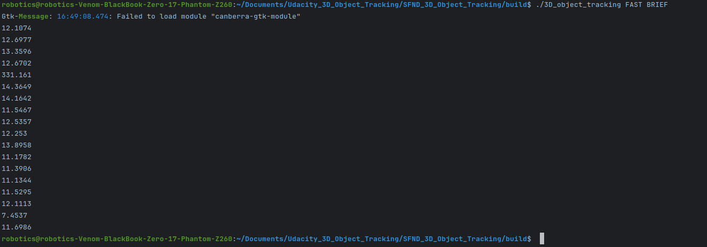
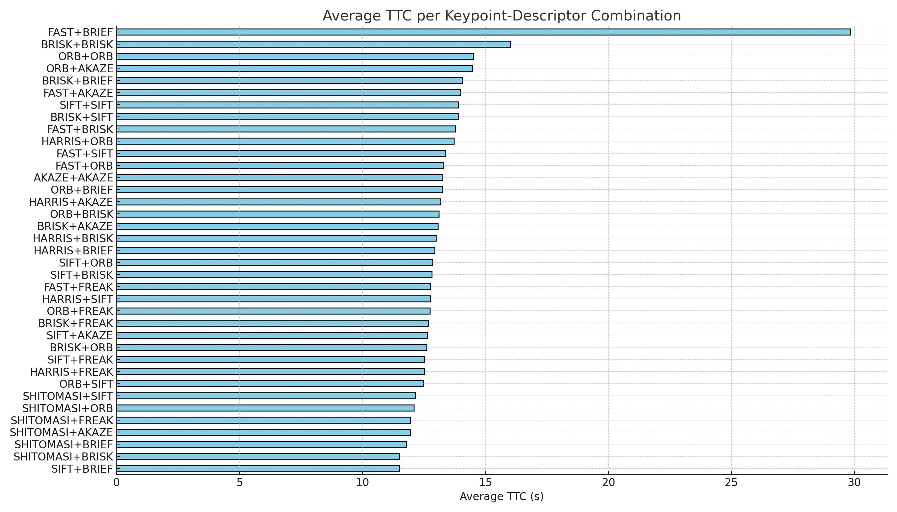

# SFND 3D Object Tracking

Welcome to the final project of the camera course. By completing all the lessons, you now have a solid understanding of keypoint detectors, descriptors, and methods to match them between successive images. Also, you know how to detect objects in an image using the YOLO deep-learning framework. And finally, you know how to associate regions in a camera image with Lidar points in 3D space. Let's take a look at our program schematic to see what we already have accomplished and what's still missing.

In this final project, you will implement the missing parts in the schematic. To do this, you will complete four major tasks: 
1. First, you will develop a way to match 3D objects over time by using keypoint correspondences. 
2. Second, you will compute the TTC based on Lidar measurements. 
3. You will then proceed to do the same using the camera, which requires to first associate keypoint matches to regions of interest and then to compute the TTC based on those matches. 
4. And lastly, you will conduct various tests with the framework. Your goal is to identify the most suitable detector/descriptor combination for TTC estimation and also to search for problems that can lead to faulty measurements by the camera or Lidar sensor. In the last course of this Nanodegree, you will learn about the Kalman filter, which is a great way to combine the two independent TTC measurements into an improved version which is much more reliable than a single sensor alone can be. But before we think about such things, let us focus on your final project in the camera course. 

## Dependencies for Running Locally
* cmake >= 2.8
  * All OSes: [click here for installation instructions](https://cmake.org/install/)
* make >= 4.1 (Linux, Mac), 3.81 (Windows)
  * Linux: make is installed by default on most Linux distros
  * Mac: [install Xcode command line tools to get make](https://developer.apple.com/xcode/features/)
  * Windows: [Click here for installation instructions](http://gnuwin32.sourceforge.net/packages/make.htm)
* Git LFS
  * Weight files are handled using [LFS](https://git-lfs.github.com/)
  * Install Git LFS before cloning this Repo.
* OpenCV >= 4.1
  * This must be compiled from source using the `-D OPENCV_ENABLE_NONFREE=ON` cmake flag for testing the SIFT and SURF detectors.
  * The OpenCV 4.1.0 source code can be found [here](https://github.com/opencv/opencv/tree/4.1.0)
* gcc/g++ >= 5.4
  * Linux: gcc / g++ is installed by default on most Linux distros
  * Mac: same deal as make - [install Xcode command line tools](https://developer.apple.com/xcode/features/)
  * Windows: recommend using [MinGW](http://www.mingw.org/)

## Basic Build Instructions

1. Clone this repo.
2. Make a build directory in the top level project directory: `mkdir build && cd build`
3. Compile: `cmake .. && make`
4. Run it: `./3D_object_tracking`.

## FP.1 Match 3D Objects

* Implement the method "matchBoundingBoxes", which takes as input both the previous and the current data frames and provides as output the ids of the matched regions of interest (i.e. the boxID property). 
Matches must be the ones with the highest number of keypoint correspondences.
* NB use multimap instead of std::map as std::map only keeps unique keys.
* Code found in camFusion_Student.cpp lines 305 to 386
* Pseudocode used is below: 
  * Have an outer loop over all keypoint matches between current frame and previous frame
  * Using keypoint matches to match bounding boxes, loop over bounding boxes in current frame 
  * Look for which keypoint is located inside the bounding box roi from current frame
  * if you find a bounding box whose roi the keypoint in question, keep track of bounding box ID
  * Loop over bounding boxes in previous frame, check if matching keypoint of said keypoint in prev frame is contained in the bounding box roi of the prev frame
  * if so keep track of bounding box ID
  * Enter the BoundingBox_ID in prev frame and BoundingBox_ID in current frame in bbmatches if they're both not -1
  * After obtaining bounding box matches, find the best bounding box matches by determining find out which pair has the highest frequency.

## FP.2 Compute Lidar-based TTC
* Compute the time-to-collision in second for all matched 3D objects using only Lidar measurements from the matched bounding boxes between current and previous frame.
* Code found in camFusion_Student.cpp lines 249 to 301
* Pseudocode used is below: 
  * Filter points to use only those within one lane width for lidar points in both current and prev frame
  * Sort the points in order of increasing x values
  * Find the median values of the x coordinate in both prev and curr frames (median is more robust to outliers than the mean)
  * Use the median values to calculate TTC using formula given in the course

## FP.3 Associate Keypoint Correspondences with Bounding Boxes
* Associate a given bounding box with the keypoints it contains
* Code found in camFusion_Student.cpp lines 140 to 188
* Pseudocode used is below: 
  * Iterate over all keypoint matches and keep those whose current keypoint lies inside the bounding box. 
  * Store the positions of these valid keypoints. 
  * Compute the mean (average) position of these keypoints. 
  * Calculate the Euclidean distance of each keypoint from the mean. 
  * Compute the standard deviation of these distances. 
  * Define a threshold as mean distance + 1.5 × standard deviation. 
  * Keep only the matches whose keypoints are within this threshold distance from the mean and add them to the bounding box.

## FP.4 Compute Camera-based TTC

* The function estimates how soon the camera will collide with an object ahead by analyzing how fast keypoints are spreading apart from one frame to the next. The faster they spread (i.e., the greater the distance ratio), the sooner the estimated collision.
* Time-To-Collision (TTC) from a camera is key to grasping how monocular vision can estimate motion and depth without knowing the absolute scale of the scene.
* We estimate TTC by observing how quickly the image of an object is expanding (i.e., keypoints are moving apart) as the camera gets closer to it.
* This is called scale change or optical expansion and it encodes how fast the object is approaching relative to its distance.
* You don’t need the actual depth — just how fast things are getting bigger on the image plane.
* Code found in camFusion_Student.cpp lines 192 to 246
* Pseudocode used is below:
  * Loop through all pairs of matched keypoints between consecutive frames. 
  * For each pair, compute distances in the previous and current frame. 
  * Filter out unreliable pairs based on minimum distance and avoid division by zero. 
  * Calculate the distance ratio (current/previous) for valid pairs. 
  * Store all distance ratios and compute their median for robustness against outliers. 
  * If no valid ratios exist, set TTC to NaN and exit. 
  * Compute Time-to-Collision (TTC) using the median distance ratio and frame rate.

## FP.5 Performance Evaluation 1

Find examples where the TTC estimate of the Lidar sensor does not seem plausible. Describe your observations and provide a sound argumentation why you think this happened.

* Lidar points are not off, they are within an acceptable range throughout. Maybe the median calculation is robust to outliers which helps with consistancy in lidar TTC
* It's interesting how the time is not monotonically decreasing even though the vehicle is definitely moving towards the vehicle in front of it. What causes this ?

TTC Lidar \
12.5156 \
12.614245 \
14.091 \
16.689386 \
15.746544 \
12.783491 \
11.984351 \
13.12412 \
13.02412 \
11.174641 \
12.808601 \
8.95978 \
9.96439 \
9.59863 \
8.521566 \
9.515525 \
9.612415 \
8.3988 

## FP.6 Performance Evaluation 2
TTC Camera values in seconds.

[//]: # ()
[//]: # (| #  | FAST keypoints + BRIEF descriptor| FAST keypoints + BRISK descriptor | FAST keypoints + ORB descriptor  | SHITOMASI keypoints + ORB descriptor | BRISK keypoints + BRISK descriptor  |)

[//]: # (|----|---------------|-------------------------|----------------------------------|----------------------------|-------------------------------------|)

[//]: # (| 1  | 12.1074       | 11.92067                | 14.72273                         | 13.6954                    | 12.82814                            |                             )

[//]: # (| 2  | 12.697676     | -inf                    | 23.04485                         | 12.768024                  | 28.98185                            |                             )

[//]: # (| 3  | 13.359617     | 13.04631                | 12.9553                          | 11.26671                   | 14.639475                           |                             )

[//]: # (| 4  | 12.670212     | 11.27993                | 14.074687                        | 12.72818                   | 18.0262                             |                             )

[//]: # (| 5  | 331.161104    | 39.113704               | -inf                             | 13.080885                  | 37.63555                            |                             )

[//]: # (| 6  | 14.3649       | 13.306518               | 13.33863                         | 13.753321                  | 15.15632                            |                             )

[//]: # (| 7  | 14.1642       | 13.0325                 | 13.5996                          | 11.749351                  | 17.81773                            |                             )

[//]: # (| 8  | 11.54672      | 11.813868               | 12.053083                        | 13.025623                  | 16.099                              |                             )

[//]: # (| 9  | 12.5357       | 11.90083                | 11.723607                        | 12.25264                   | 12.8582                             |                             )

[//]: # (| 10 | 12.252967     | 13.360675               | 13.5653                          | 13.055343                  | 13.33675                            |                             )

[//]: # (| 11 | 13.895767     | 12.53584                | 13.5996                          | 10.95845                   | 12.5974                             |                             )

[//]: # (| 12 | 11.178178     | 12.254113               | 13.33426                         | 12.0043                    | 12.0911                             |                             )

[//]: # (| 13 | 11.390586     | 12.06402                | 11.589684                        | 12.63392                   | 12.0827                             |                             )

[//]: # (| 14 | 11.1344       | 12.32915                | 11.607725                        | 12.50973                   | 12.8117                             |                             )

[//]: # (| 15 | 11.52954      | 11.0367                 | 12.403989                        | 10.43026                   | 16.298592                           |                             )

[//]: # (| 16 | 12.11133      | 12.150221               | 12.13756                         | 12.876473                  | 11.27715                            |                             )

[//]: # (| 17 | 7.45371       | 10.231                  | 10.76764                         | 11.00735                   | 10.53112                            |                             )

[//]: # (| 18 | 11.698638     | 12.6654                 | 11.20737                         | 7.75039                    | 13.19067                            |                             )

[//]: # ()
[//]: # (* Using Fast Keypoints,TTC calculation fails on frames 2 and 5 &#40;for BRIEF,BRISK and ORB descriptor&#41;. It's either a very large number, or  -inf in some cases.)

[//]: # (* When I switch to Shitomasi Keypoints + ORB descriptor they actually do really well. No TTC camera value is overly large or inf.)

[//]: # (* With BRISK Keypoints +  BRISK descriptor, values are fluctuating a lot and getting in the range of 30s. TTC values are in a range higher than the other keypoint descripter combinations considered.)

* Using command-line arguments to dynamically adjust how the program runs each time
* The TTC values for all 36 detector / descriptor combinations implemented in 2D_Tracking project are recorded in the spreadsheet attached "images/ TTC_Keypoint_Descriptor_Combinations.xlsx"

* From the spreadsheet and plot (based on averages):

* SHITOMASI + ORB
  * Consistent across all frames 
  * Average TTC ~12–13s 
  * No -inf or extreme outliers

* FAST + BRIEF / FAST + BRISK / FAST + ORB
  * Often give -inf or huge TTCs (especially frame 2 and 5)
  * High variance
  * Not robust

* BRISK + BRISK
  * Some realistic values 
  * But average is high (~30s), and lots of fluctuation 
  * Less reliable

